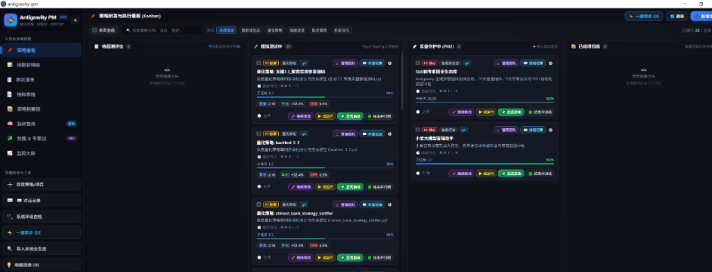
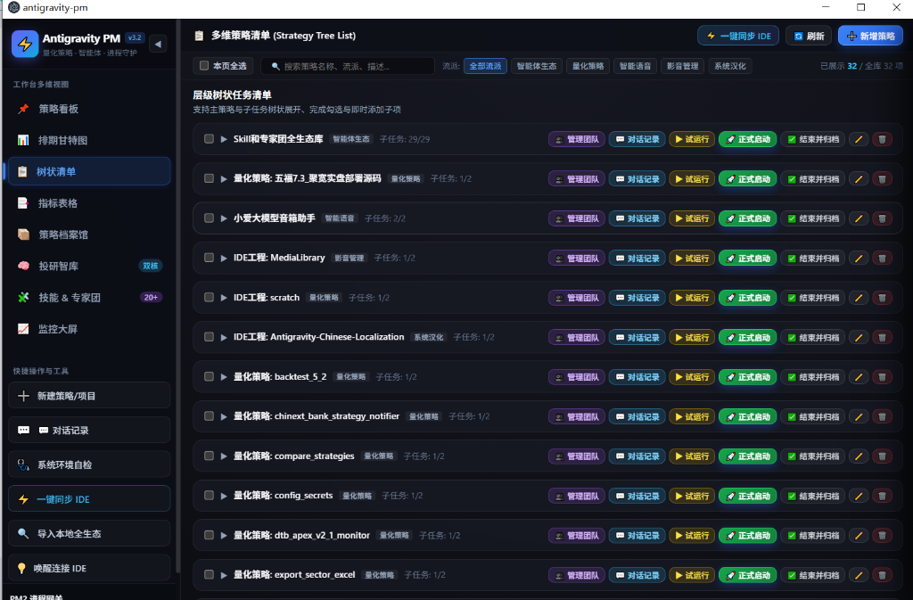
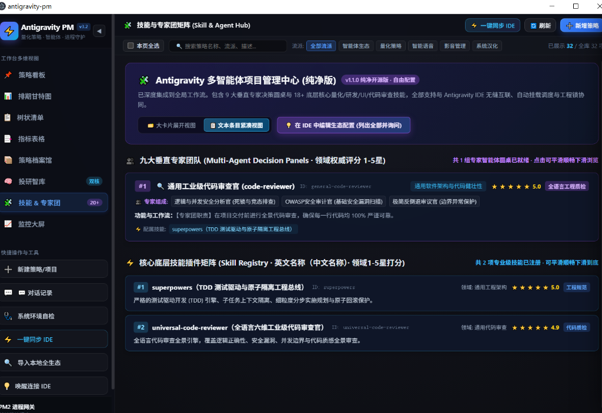

# Antigravity-PM (Antigravity Project Manager)

<p align="center">
  <b>🚀 专为 Antigravity 打造的高颜值可视化项目、专家团与 Skill 协同调度总线</b><br>
  <sub>全域多智能体协同 · 微信式对话上下文交互 · PM2 进程守护 · 一键环境诊断与自愈</sub>
</p>

<p align="center">
  <a href="./Pure/"></a>
  <a href="./Full/"></a>
  <a href="https://github.com/MUMUMU23333/Antigravity-PM/blob/main/LICENSE"></a>
  
  
</p>

---

## 📂 仓库目录划分与下载指引

为了方便广大开发者按需下载与集成，本项目在仓库中明确分为 **纯净版 (`Pure/`)** 与 **完整版 (`Full/`)** 两个独立文件夹：

| 版本文件夹 | 预装内容 | 核心适用场景 | 下载与体验建议 |
| :--- | :--- | :--- | :--- |
| [📁 **Pure (纯净版)**](./Pure/) | 零预装策略、精简轻量、标准空白项目母版 | 自定义搭建自己的业务策略、投研看板或作为独立脚手架二次分发 | **极力推荐企业/个人开发者首选**，无冗余数据 |
| [📁 **Full (完整版)**](./Full/) | 内置 9 大全景专家团 + 18 个全功能 Skill + 完整多因子动量等实战案例 | 体验投研圆桌对决、高打击感小游戏工坊、Bento 网页架构等全套生态 | **推荐初学者或希望一站式体验完整生态的用户** |

---

## 🌟 核心特性亮点

- 🎨 **现代化 Bento 栅格看板**：告别简陋命令行，所有量化策略、研发工程、自媒体流水一屏尽收眼底。
- 👥 **专家团与 Skill 深度协同**：支持为不同项目灵活分配专属 AI 专家团队（如投研圆桌、小游戏工坊）与技能工具包（如实时数据、打击感引擎、代码质检）。
- 💬 **微信式对话记录与流畅滚轮浏览 (NEW)**：
  - 自动归集 Antigravity IDE 专家推进流水，以微信气泡方式呈现用户需求与 AI 回复；
  - **支持鼠标滚轮自由向上滑动查看完整历史上下文**；
  - **智能吸底解脱**：向上滑动时自动暂停自动滚动，方便安稳阅读；下滑触底或点击「⬇️ 跳到最新对话」自动平滑恢复吸底。
- ⚡ **PM2 工业级进程守护**：一键试运行、后台挂机守护、自动拉起、实时监控 CPU/内存/PID。
- 🩺 **系统大夫 (System Doctor)**：一键诊断 Python、Node.js、Git、PM2、依赖库并支持一键自动修复。
- 🧠 **双向 IDE 记忆唤醒**：点击「继续修改」可一键启动 Antigravity IDE，并自动加载项目历史日志与专家上下文。

---


---

## 📸 系统全景界面预览 (Screenshots)

简洁直观的高端 Bento 深色界面，专为中国人日常操盘与研发习惯设计：

### 1. 📊 策略研发与执行看板 (Kanban View)
清晰呈现四大生命周期阶段（待回测评估 ➔ 模拟测试中 ➔ 实盘守护中 ➔ 已结项归档），量化指标与夏普/最大回撤一屏了然，支持一键试运行与后台守护托管。
<p align="center">
  
</p>

### 2. 🌲 多维树状策略清单 (Strategy Tree List)
支持策略与子任务树状级联展开、完成勾选即时联动、多流派智能筛选（量化策略、智能体生态、影音管理、智能语音等），批量调度管理游刃有余。
<p align="center">
  
</p>

### 3. 🧩 技能与九大专家团矩阵中心 (Skill & Agent Hub)
完整调度 9 大垂直行业决策圆桌（星辰投研团、腾讯自选股圆桌、独立小游戏工坊、高端网页架构师等）与 20+ 底层专业技能，支持大卡片与紧凑条目自由切换，一键与 IDE 深度记忆互通。
<p align="center">
  
</p>

## 🚀 快速上手 (Quick Start)

### 1. 下载仓库
您可以通过 Git 克隆本仓库：
```bash
git clone https://github.com/MUMUMU23333/Antigravity-PM.git
```
或者在 GitHub 右上角点击 **Code -> Download ZIP** 下载解压。

### 2. 选择您需要的版本
进入对应的文件夹即可：
- **运行纯净版**：进入 `Pure/` 目录，双击 `run.bat`
- **运行完整版**：进入 `Full/` 目录，双击 `run.bat`

*(首次运行请确保本地已安装 Node.js 18+ 并在当前目录执行 `npm install`)*

---

## 📝 更新日志 (Changelog)

详细演进记录请参考 [CHANGELOG.md](./CHANGELOG.md)。

- **v1.2.0**：
  - 📁 仓库正式重组为 `Pure/` (纯净版) 与 `Full/` (完整版) 双文件夹架构；
  - 🖱️ 修复对话记录抽屉鼠标滚轮无法滑动查看上下文的问题，加入向上智能暂停吸底与触底自动恢复；
  - 🔘 抽屉底部增加「自动吸底 / 自由滚轮阅读」双模态状态指示与手动切换。
- **v1.1.0**：优化纯净标准模板与跨平台兼容性。
- **v1.0.0**：正式发布全套 Antigravity-PM 可视化管理与进程托管套件。

---

## 📄 开源许可 (License)

本项目基于 [MIT License](./LICENSE) 协议完全开源，欢迎 Star、Fork 并自由定制传播！
